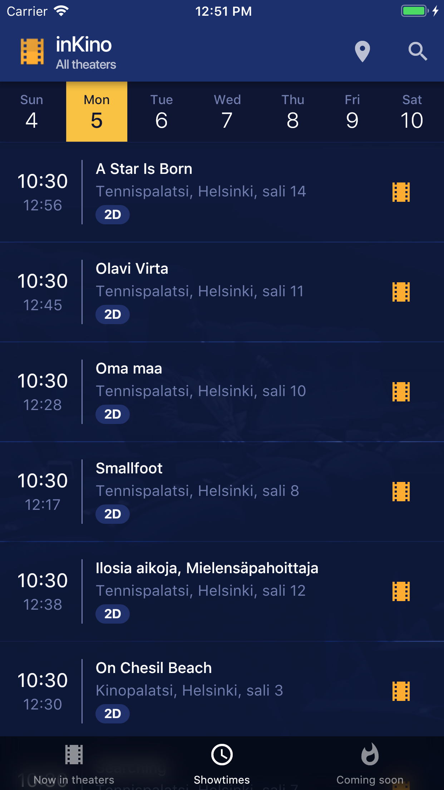
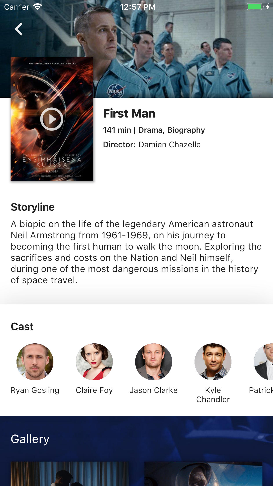

# inKino - a multiplatform Dart project with code sharing between Flutter and web

  

## What is inKino?

[](https://travis-ci.org/roughike/inKino)

inKino is a _multiplatform_ Dart app for browsing movies and showtimes for Finnkino cinemas. 

InKino showcases Redux, has an extensive set of automated tests and **40% code sharing between Flutter and web**.
The Android & iOS apps are made with a single [Flutter](http://flutter.io) codebase. The progressive web app is made with [AngularDart](https://webdev.dartlang.org/angular). 
This project is generally something that I believe is a good example of a multiplatform Dart project.

I plan on doing a full article series on multiplatform Dart stuff, so you might want to [check out my blog](https://iirokrankka.com) and subscribe to it.

<div>
<a href='https://play.google.com/store/apps/details?id=com.roughike.inkino'></a>
<a href='https://itunes.apple.com/us/app/inkino/id1367181450'></a>
<a href='https://inkino.app'></a>
</div>

## Folder structure

There's three different folders. Each of them is a Dart project.

* **core**: contains the pure Dart business logic, such API communication, Redux, XML parsing, sanitization, i18n, models and utilities. 
It also has a great test coverage.
* **mobile**: this is the Flutter project. It imports **core**, and it's a 100% shared codebase for the native Android & iOS apps that go on app stores.
* **web**: the AngularDart progressive web app. Also imports **core**, and it's the thing that is live at https://inkino.app.

To work on these projects, open each one of them in an editor of your choice. 

For example, if you want to do a new feature and you do it for the Flutter project first, you'd open both **core** and **mobile** in separate editor windows.
To clarify, you'd do `File -> Open...` for core and then `File -> Open...` again for mobile.

## Development environment setup

* [Install Dart for the web](https://webdev.dartlang.org/tools/sdk#install). The customized Dart version Flutter ships with is not suitable for web development.
* Install [webdev](https://webdev.dartlang.org/tools/webdev) by running `pub global activate webdev`. This requires that you ran your Dart installation properly and Dart is part of your PATH.
* Install an IDE. You can't go wrong with [WebStorm](https://webdev.dartlang.org/tools/webstorm). If that doesn't tickle your fancy, [there are other options too](https://www.dartlang.org/tools#ides).
* Install the Dart plugin for your IDE.

Finally, if you haven't already, [install Flutter](https://flutter.io/docs/get-started/install).
And the Flutter plugin for your IDE. 
At the time of being, inKino is built with **Flutter 1.0**.

If you don't like IDEs, [you can apparently use Emacs or Vim too](https://news.ycombinator.com/item?id=16822780).

## Building the project

### Renaming the TMDB configuration file

You don't need a TMDB API key, but the actor images won't load without it.

If you try to build the project straight away, you'll get an error complaining that a tmdb_config.dart file is missing.
To resolve that, run this on your terminal in the project root:

```bash
cd core/lib/src && mv tmdb_config.dart.sample tmdb_config.dart && cd ../../..
```

**OR**

If you don't trust in random bash scripts copied from the Internet, you can just rename the `tmdb_config.dart.sample` to `tmdb_config.dart` manually.

### Building from source

First, ensure that you followed the "Development environment setup" section above.

* To run the **web project**, first run `pub get` initially, and then `webdev serve` in the root of the web project.
* To run the **Flutter project**, open it in your editor and click the play button, or run `flutter run` on your terminal.

## Contributing

Contributions are welcome! 
However, if it's going to be a major change, please create an issue first. 
Before starting to work on something, please comment on a specific issue and say you'd like to work on it.

## Thanks

Special thanks to [Olli Haataja](https://www.linkedin.com/in/olli-haataja-46b96b120/) for the design. 

Additional thanks for the initial release go to [Thibaud Colas](https://twitter.com/thibaud_colas), [Brian Egan](https://twitter.com/brianegan), [Alessandro Aime](https://twitter.com/aimealessandro) and [Juho Rautioaho](https://github.com/Jraut) for giving their extra pair of eyes for reviewing the source code.
